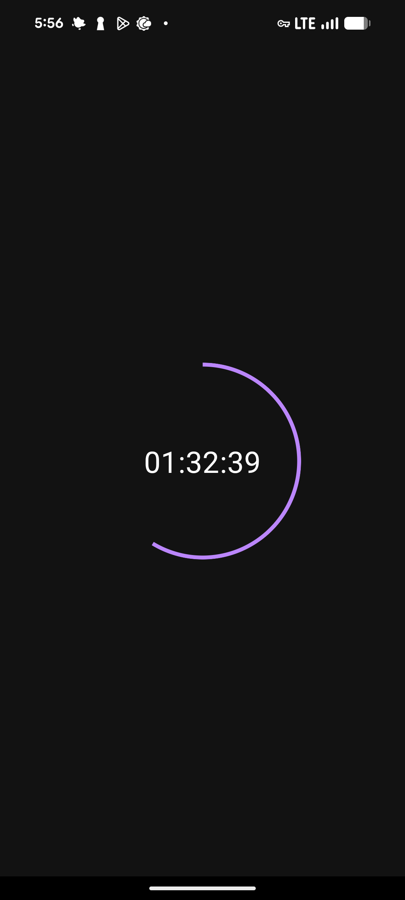
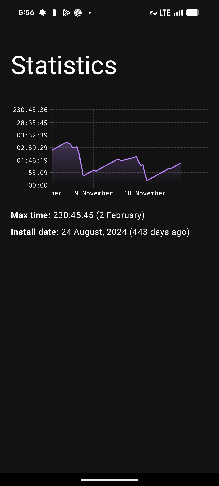

# LifeTime

> A wallet for your time

|                             |                             |
| --------------------------- | --------------------------- |
|  |  |

LifeTime turns time into currency. I created this application in 2023 and use it
till this day. What the app essentially does is it gives you 2 hours of the time
that you can spend the way you want. I personally restricted all the internet
usage to this 2 hours, but you may want to be less extreme and restrict just
YouTube or something else. It's up to you.

I love the idea and it helps me with reframing my focus. Now I don't want to
spend more time watching YouTube videos since I know for a fact that every time
I work my free time is not going anywhere. If I worked hard 6 days, I can save
12 hours and then just chill for a few days. That was basically the problem with
all the 'Screen Time = 2h' things. They do not add up.

Even though I actively use this app for several years I am not that interested
in improving it since it solves my case perfectly. However, I do look forward
collaboartion: we can create a new github organization, write iOS clients and
stuff. If you want to contribute, [contact me](https://y9san9.me). I definitely
want to see more customization settings.

P.s. inspired by the movie _Time_.

## Code

From the code perspective, it's a pure experiment. Since we only have 2 screens
here, I think it would be very easy to rewrite. The app was intended to be an
experiment, so it's not how I actually write code lol. I would like to rewrite
it and make it simpler, but no time :(
